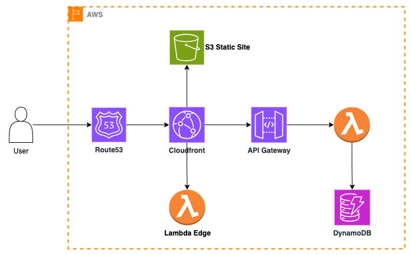

# AWS Cloud Resume Challenge

This is my take on [AWS Cloud Resume Challenge](https://cloudresumechallenge.dev/docs/the-challenge/aws/)

## Architecture

| Service  | Description |
| ------------- | ------------- |
| Route53  | DNS resolver  |
| Cloudfront  | Content Delivery network  |
| S3  | Store [React static site content](https://github.com/hungnv-sr/React-Portfolio)  |
| Api Gateway  | Serve HTTP API  |
| Lambda  |  Count request and save to database. This will only count the requests made from browser  |
| Lambda@Edge  | Count all requests to Cloudfront and save to database (bot requests included)   |
| DynamoDB  | Database  |
